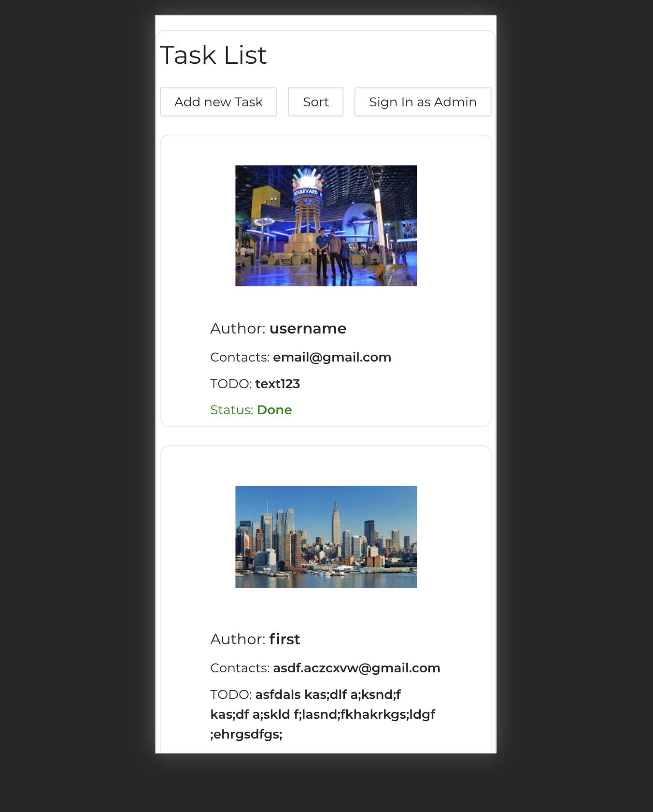

# Beejee-test

### `yarn`

Downloads all dependencies

### `yarn start`

Launches the app.

## Home page:

## Adding new task (all users):

## Login as admin, only admin can edit the task: (login: admin, pass: 123)

## Optimised for phone:

##  Use with pleasure!
